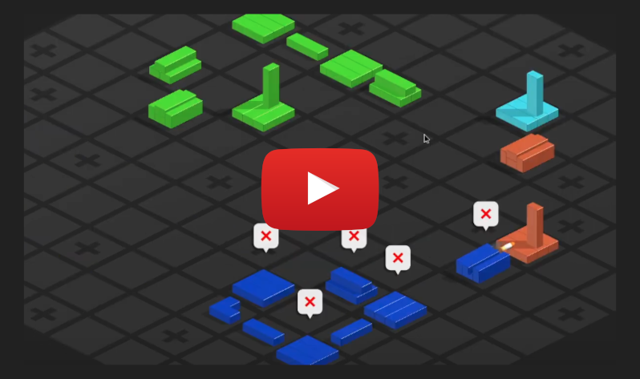
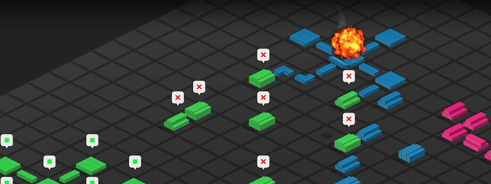

Welcome to the public release repository for **Jen**, a turn-based strategy game built with the Unity game engine. 

## Game Overview

**Jen** is a turn-based game where players control **Tanks** and **Cities** on a grid of square tiles. The goal is to be the last player with a "significant presence" on the board. 

For the complete manual and detailed gameplay instructions, please refer to the **MANUAL.pdf** included in this release. 

## Download

Jen is available on Linux and Windows. You can download the latest version of Jen for your platform from the [releases](https://github.com/yojoecapital/jen-public-release/releases/latest) page. Simply choose the appropriate binary for your system, download, and start playing!

## What's planned in for the future?

Jen currently does not feature AI-controlled players or online multiplayer. All players must be human and play on the same machine. However, I plan to develop AI to play Jen. I initially explored using a mini-max algorithm, but the branching factor of the game was too large for practical use. In the future, I may experiment with using multiple decision trees through recursive partitioning to control AI players or possibly train a neural network to improve AI capabilities. Additionally, I intend to host an online multiplayer server in a future update. But for now, Jen is fully playable and still a great time with some friends.

